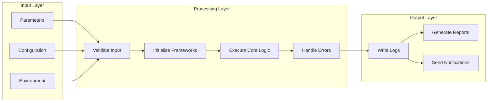
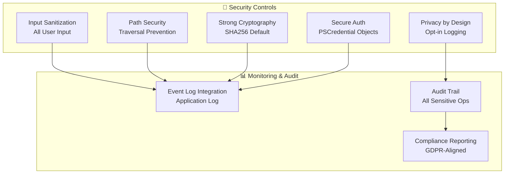

# PowerShell Scripts Repository | Repositório de Scripts PowerShell

> **EN**: A production-grade collection of system administration PowerShell scripts for Windows environments. Built with security, automation, and operational excellence as core principles. Designed for IT professionals managing enterprise Windows infrastructure.

> **PT**: Uma coleção de nível profissional de scripts de administração de sistema PowerShell para ambientes Windows. Construída com segurança, automação e excelência operacional como princípios fundamentais. Desenvolvida para profissionais de TI gerenciando infraestrutura Windows empresarial.

[](LICENSE)
[](https://microsoft.com/powershell)
[](SECURITY.md)
[](ENHANCEMENTS_IMPLEMENTED.md)

**Latest Release | Última Versão**: v2.0 (January 2026)

---

## 📊 Current Status | Estado Actual (v2.0 - January 2026)

| Module | Módulo | Status EN | Estado PT | Maturity | Maturidade |
|--------|-----------|-----------|-----------|-----------|
| **Core Framework** | Framework Core | ✅ Complete | ✅ Completo | Production | Produção |
| **Configuration** | Configuração | ✅ Complete | ✅ Completo | Production | Produção |
| **Logging** | Registo | ✅ Complete | ✅ Completo | Production | Produção |
| **Error Handling** | Tratamento de Erros | ✅ Complete | ✅ Completo | Production | Produção |
| **Measure-TransferSpeed** | Velocidade de Transferência | ✅ Enhanced | ✅ Melhorado | Production | Produção |
| **Show-Notification** | Mostrar Notificação | ✅ Enhanced | ✅ Melhorado | Production | Produção |
| **USB Port Management** | Gestão de Portas USB | ✅ Enhanced | ✅ Melhorado | Production | Produção |
| **Find-DuplicateFiles** | Encontrar Ficheiros Duplicados | ✅ Enhanced | ✅ Melhorado | Production | Produção |
| **RebootReminder** | Lembrete de Reinício | ✅ Enhanced | ✅ Melhorado | Production | Produção |
| **DeploymentScript** | Script de Implementação | ✅ Enhanced | ✅ Melhorado | Production | Produção |
| **FindEmptyFolders** | Encontrar Pastas Vazias | ✅ Enhanced | ✅ Melhorado | Production | Produção |
| **ClearTeamsCache** | Limpar Cache Teams | ✅ Enhanced | ✅ Melhorado | Production | Produção |
| **ShowBalloonTips** | Mostrar Dicas Balão | ⚠️ Deprecated | ⚠️ Descontinuado | Legacy | Legado |

---

## 🔐 Security Status | Estado de Segurança

**Latest Security Update | Atualização de Segurança Recente**: v2.0 (January 2026)

| Security Issue | Issue de Segurança | Status | Description | Descrição |
|---------------|--------------------|--------|-------------|------------|
| Input Validation | Validação de Entrada | ✅ Fixed | All scripts implement comprehensive input sanitization | Todos os scripts implementam saneamento de entrada |
| Injection Protection | Protecção de Injeção | ✅ Fixed | WMI/CIM injection prevention with parameterized queries | Prevenção de injeção WMI/CIM com consultas parametrizadas |
| Cryptographic Standards | Padrões Criptográficos | ✅ Fixed | SHA256 default, MD5 deprecated | SHA256 predefinido, MD5 descontinuado |
| Authentication | Autenticação | ✅ Fixed | Secure credential management with PSCredential objects | Gestão de credenciais segura com objetos PSCredential |
| Privacy Protection | Protecção de Privacidade | ✅ Fixed | Opt-in user logging, no PII in logs by default | Registo de utilizador opcional, sem PII em logs |
| Path Traversal | Traversal de Caminho | ✅ Fixed | Comprehensive path validation and sanitization functions | Validação e saneamento abrangentes de caminhos |
| XML Injection | Injeção XML | ✅ Fixed | XML entity escaping in Show-Notification | Escapamento de entidades XML em Show-Notification |
| Registry Injection | Injeção de Registo | ✅ Fixed | Alphanumeric-only validation in RebootReminder | Validação apenas alfanumérica em RebootReminder |

See [SECURITY.md](SECURITY.md) for full security documentation. | Veja [SECURITY.md](SECURITY.md) para documentação completa de segurança.

---

## 🎯 Overview | Visão Geral

### EN-US

**PowerShell Scripts Repository** is a comprehensive collection of enterprise-grade PowerShell scripts designed for Windows system administration. Built with security, scalability, and operational excellence as core principles, the repository handles everything from network performance testing to duplicate file management, from USB device control to automated software deployment.

### PT-AO/PT-PT

**PowerShell Scripts Repository** é uma coleção abrangente de scripts PowerShell de nível empresarial, desenhados para administração de sistemas Windows. Construído com segurança, escalabilidade e excelência operacional como princípios fundamentais, o repositório trata de tudo, desde testes de desempenho de rede até gestão de ficheiros duplicados, desde controlo de dispositivos USB até implementação automatizada de software.

---

## ✨ Core Features | Funcionalidades Principais

### Framework Modules | Módulos Framework

#### Configuration Management | Gestão de Configuração
- **EN**: Centralized configuration with XML persistence • Default templates and environment overrides • Consistent settings across all scripts • Environment-aware configuration
- **PT**: Configuração centralizada com persistência XML • Templates predefinidos e substituições de ambiente • Configurações consistentes em todos os scripts • Configuração com consciência de ambiente

**Tangible Benefits | Benefícios Tangíveis:**
- ✅ Single source of truth for configuration
- ✅ Easy updates across all scripts
- ✅ Environment-specific overrides
- ✅ Persistent settings between runs

#### Unified Logging | Registo Unificado
- **EN**: Multi-output logging (console, file, event log) • Automatic log rotation (10MB default) • Structured CSV logging with timestamps • Transaction tracking for complex operations • Searchable log history with summary reporting
- **PT**: Registo multi-saída (consola, ficheiro, registo de eventos) • Rotação automática de logs (10MB predefinido) • Registo CSV estruturado com timestamps • Rastreamento de transações para operações complexas • Histórico de pesquisável com relatórios de resumo

**Tangible Benefits | Benefícios Tangíveis:**
- ✅ Consistent logging format across all scripts
- ✅ Automatic log rotation prevents disk bloat
- ✅ Event log integration for centralized monitoring
- ✅ Transaction tracking for complex operations
- ✅ Searchable audit trails

#### Error Handling Framework | Framework de Tratamento de Erros
- **EN**: Retry logic with configurable attempts • Pre-flight system checks (PowerShell version, admin rights, network, disk space) • Graceful degradation on failures • Standardized error messages • Comprehensive stack traces
- **PT**: Lógica de retry com tentativas configuráveis • Verificações prévias do sistema (versão PowerShell, direitos admin, rede, espaço disco) • Degradação graciosa em falhas • Mensagens de erro padronizadas • Stack traces abrangentes

**Tangible Benefits | Benefícios Tangíveis:**
- ✅ Automatic retry for transient failures
- ✅ Comprehensive system checks before execution
- ✅ Graceful failure handling with detailed errors
- ✅ Consistent error messages across scripts
- ✅ Troubleshooting-friendly stack traces

### Script Modules | Módulos de Scripts

#### 1. Measure-TransferSpeed | Velocidade de Transferência
- **EN**: Network performance testing with historical tracking • Multi-path testing for redundancy validation • Bandwidth throttling analysis • Latency measurement with packet loss detection • Professional HTML reports with trend analysis
- **PT**: Testes de desempenho de rede com rastreamento histórico • Testes de múltiplos caminhos para validação de redundância • Análise de limitação de largura de banda • Medição de latência com detecção de perda de pacotes • Relatórios HTML profissionais com análise de tendências

**Real World Scenarios | Cenários do Mundo Real:**
- Enterprise network baseline testing before migrations
- Cloud migration performance validation
- SLA compliance verification
- Data-driven capacity planning

#### 2. Show-Notification | Mostrar Notificação
- **EN**: Modern Windows 10+ toast notifications • Template-based notification system (5 built-in templates) • Notification queue with retry mechanism • User preference management (quiet hours, notification types) • Scheduled notifications with recurring support • Button actions and response tracking
- **PT**: Notificações toast modernas Windows 10+ • Sistema de notificação baseado em templates (5 templates integrados) • Fila de notificação com mecanismo de retry • Gestão de preferências do utilizador (horas de silêncio, tipos de notificação) • Notificações agendadas com suporte recorrente • Ações de botões e rastreamento de respostas

**Real World Scenarios | Cenários do Mundo Real:**
- IT service desk notifications for maintenance windows
- Software update alerts with install prompts
- Security incident notifications with action buttons
- Patch Tuesday reminders with scheduling

#### 3. USB Port Management | Gestão de Portas USB
- **EN**: GUI-based USB storage device control • Device whitelisting for approved hardware • Time-based access control (work hours only) • Policy-based management (High/Medium/Low security) • Real-time USB device monitoring with event logging • Storage card access management
- **PT**: Controlo de dispositivos de armazenamento USB baseado em GUI • Lista de permissões para hardware aprovado • Controlo de acesso baseado em tempo (apenas horas de trabalho) • Gestão baseada em políticas (segurança Alta/Média/Baixa) • Monitorização em tempo real de dispositivos USB com registo de eventos • Gestão de acesso a cartões de armazenamento

**Real World Scenarios | Cenários do Mundo Real:**
- Corporate security policy enforcement for data loss prevention
- Kiosk and public access computer restrictions
- Time-based USB access (work hours only)
- Device approval workflow for specific hardware

#### 4. Find-DuplicateFiles | Encontrar Ficheiros Duplicados
- **EN**: Intelligent duplicate resolution (Newest/Largest/MostAccessed strategies) • Cross-directory comparison and detection • HTML reporting with professional dashboards • File type analysis for targeted cleanup • Automated scheduled scanning • Simulation mode for safe testing
- **PT**: Resolução inteligente de duplicados (estratégias Mais Recente/Mais Acedido/Mais Visto) • Comparação e deteção entre diretórios • Relatórios HTML com dashboards profissionais • Análise de tipo de ficheiro para limpeza direcionada • Varredura automatizada agendada • Modo de simulação para testes seguros

**Real World Scenarios | Cenários do Mundo Real:**
- Server storage optimization and cleanup
- Data migration consolidation to eliminate duplicates
- Backup storage reduction before archival
- File type analysis for storage planning

#### 5. RebootReminder | Lembrete de Reinício
- **EN**: Scheduled reboot management with configurable warnings • Reboot compliance reporting across all computers • Graceful application shutdown before restart • Patch Tuesday coordination • Weekend protection (no reboots on weekends) • Reboot history and trend analytics
- **PT**: Gestão de reinícios agendados com avisos configuráveis • Relatórios de conformidade de reinício em todos os computadores • Encerramento gracioso de aplicações antes de reiniciar • Coordenação de Patch Tuesday • Proteção de fim de semana (sem reinícios aos fins de semana) • Histórico de reinícios e análises de tendências

**Real World Scenarios | Cenários do Mundo Real:**
- Scheduled reboots with advance user warnings
- Compliance tracking across enterprise computers
- Patch Tuesday automation with grace periods
- Automated weekend protection for business continuity

#### 6. DeploymentScript | Script de Implementação
- **EN**: Staged deployment pipeline (Pilot → Production) • Rollback capability for failed installations • User notifications before deployment • Pre-deployment validation (network, admin access, disk space) • Deployment dashboard with real-time status • Support for MSI and other installers
- **PT**: Pipeline de implementação em fases (Piloto → Produção) • Capacidade de rollback para instalações falhadas • Notificações de utilizador antes da implementação • Validação pré-implementação (rede, acesso admin, espaço disco) • Dashboard de implementação com status em tempo real • Suporte para MSI e outros instaladores

**Real World Scenarios | Cenários do Mundo Real:**
- Enterprise software rollout (500+ computers)
- Office 365 deployment with coordinated rollouts
- Application updates with automatic rollback
- User notification before installation windows

#### 7. FindEmptyFolders | Encontrar Pastas Vazias
- **EN**: Smart empty folder detection with filtering (system, hidden, age) • Automated recursive cleanup • Owner-based analysis for audit • Safe deletion with backup options • Exclusion list support • Scheduled cleanup automation
- **PT**: Detecção inteligente de pastas vazias com filtragem (sistema, oculto, idade) • Limpeza recursiva automatizada • Análise baseada em proprietário para auditoria • Eliminação segura com opções de backup • Suporte para lista de exclusões • Automação de limpeza agendada

**Real World Scenarios | Cenários do Mundo Real:**
- Archive cleanup before data migration
- User home directory cleanup after employee departure
- Directory structure optimization
- Automated maintenance scheduling

#### 8. ClearTeamsCache | Limpar Cache Teams
- **EN**: Remote Teams cache clearing with user notifications • Cache analytics to identify problem computers • Troubleshooting workflow for systematic problem solving • Scheduled maintenance automation • Per-computer reporting with size tracking
- **PT**: Limpeza remota de cache Teams com notificações de utilizador • Análise de cache para identificar computadores problemáticos • Fluxo de troubleshooting para resolução sistemática de problemas • Automação de manutenção agendada • Relatório por computador com rastreamento de tamanho

**Real World Scenarios | Cenários do Mundo Real:**
- Scheduled Teams cache maintenance for performance
- Help desk remote troubleshooting automation
- Proactive cache clearing for problematic users
- Performance analytics across Teams deployments

#### 9. ShowBalloonTips | Mostrar Dicas Balão
- **Status**: DEPRECATED / DESCONTINUADO

- **EN**: Classic balloon tip notifications for Windows (deprecated in Windows 10+)
- **PT**: Notificações de dicas de balão clássicas para Windows (descontinuadas no Windows 10+)

**Migration Path | Caminho de Migração**: Use `Show-Notification.ps1` for modern toast notifications with advanced features.

---

## 🏗️ Architecture | Arquitectura

### System Architecture Diagram | Diagrama de Arquitectura do Sistema

```mermaid
flowchart TB
    subgraph Framework["🔧 Framework Layer"]
        Config["Configuration Management<br/>Centralized Settings"]
        Logging["Unified Logging<br/>Multi-Output + Rotation"]
        ErrorHandler["Error Handling<br/>Retry + Pre-flight Checks"]
    end

    subgraph Scripts["📜 Script Modules"]
        TransferSpeed["Measure-TransferSpeed<br/>Network Testing"]
        Notification["Show-Notification<br/>Toast System"]
        USBMgmt["USB Port Management<br/>Device Control"]
        Duplicates["Find-DuplicateFiles<br/>Storage Optimization"]
        Reboot["Reboot Reminder<br/>System Maintenance"]
        Deployment["Deployment Script<br/>Software Distribution"]
        EmptyFolders["Find-EmptyFolders<br/>Directory Cleanup"]
        TeamsCache["Clear Teams Cache<br/>App Maintenance"]
    end

    subgraph Security["🛡️ Security Layer"]
        InputVal["Input Validation<br/>Sanitization"]
        PathVal["Path Traversal<br/>Prevention"]
        AuthCheck["Authentication<br/>Credential Management"]
        RLS["Data Protection<br/>Privacy Controls"]
    end

    subgraph Outputs["📤 Output Layer"]
        Logs["Structured Logs<br/>CSV + Event Log"]
        Reports["HTML Reports<br/>Dashboards"]
        Audit["Audit Trails<br/>Compliance Tracking"]
    end

    Framework --> Scripts
    Scripts --> Security
    Security --> Outputs
```



### Data Flow Architecture | Arquitectura de Fluxo de Dados



### Technology Stack | Stack Tecnológico

| Component | Componente | Technology | Versão | Purpose EN | Propósito PT |
|-----------|-------------|------------|---------|------------|--------------|
| **Core Engine** | Engine Principal | PowerShell | 5.1+ | Script execution language | Linguagem de execução de scripts |
| **Configuration** | Configuração | XML + CliXML | - | Persistent settings storage | Armazenamento de configurações persistente |
| **Logging** | Registo | CSV + Event Log | - | Structured audit trails | Trilhas de auditoria estruturadas |
| **GUI Components** | Componentes GUI | Windows Forms | .NET | Graphical user interfaces | Interfaces de utilizador gráficas |
| **Notifications** | Notificações | Toast API | Windows 10+ | Modern notifications system | Sistema de notificações moderno |
| **Network** | Rede | CIM/WMI | - | Remote system management | Gestão de sistemas remotos |
| **Validation** | Validação | Regex | - | Input sanitization | Saneamento de entrada |
| **Cryptography** | Criptografia | SHA256 | - | Secure file hashing | Hashing seguro de ficheiros |

### Security Model | Modelo de Segurança



---

## 📦 Project Structure | Estrutura do Projeto

```
PowerShellScripts/
├── modules/                    # Core framework modules | Módulos framework principais
│   ├── Configuration.psm1       # Config management | Gestão de configuração
│   ├── Logging.psm1             # Unified logging | Registo unificado
│   └── ErrorHandling.psm1        # Error handling | Tratamento de erros
├── Measure-TransferSpeed/        # Network performance | Desempenho de rede
│   ├── Measure-TransferSpeed.ps1
│   └── README.md
├── Show-Notification/            # Notification system | Sistema de notificação
│   ├── Show-Notification.ps1
│   └── README.md
├── USBPortManagement/            # USB device control | Controlo de dispositivos USB
│   ├── USBManagementTool.ps1
│   └── README.md
├── Find-DuplicateFiles/           # Duplicate detection | Detecção de duplicados
│   ├── Find-DuplicateFiles.ps1
│   └── README.md
├── RebootReminder/               # Reboot management | Gestão de reinícios
│   ├── RebootReminder.ps1
│   └── README.md
├── DeploymentScript/              # Software deployment | Implementação de software
│   ├── DeploymentScript.ps1
│   └── README.md
├── FindEmptyFolders/              # Directory cleanup | Limpeza de diretórios
│   ├── FindEmptyFolders.ps1
│   └── README.md
├── ClearTeamsCache/              # Teams maintenance | Manutenção Teams
│   ├── ClearTeamsCache.ps1
│   └── README.md
├── ShowBalloonTips/              # [DEPRECATED] Legacy notifications | Notificações legadas
│   ├── Show-BallonTips.ps1
│   └── README.md
├── docs/                         # Documentation | Documentação
│   └── pt-PT/                 # Portuguese documentation | Documentação em português
├── SECURITY.md                   # Security documentation | Documentação de segurança
├── SECURITY_CHECKLIST.md         # Security review checklist | Lista de verificação de segurança
├── SECURITY_AUDIT_SUMMARY.md     # Security audit findings | Descobertas de auditoria de segurança
├── CONTRIBUTING.md                # Contribution guide | Guia de contribuição
├── CHANGELOG.md                  # Version history | Histórico de versões
├── CODE_OF_CONDUCT.md            # Community guidelines | Diretrizes da comunidade
├── LICENSE                       # MIT License | Licença MIT
└── README.md                     # This file | Este ficheiro
```

---

## 🚀 Getting Started | Começar

### Prerequisites | Pré-requisitos
- **EN**: PowerShell 5.1 or later (Windows 10+ recommended) • Administrator privileges for most scripts • Windows Management Framework (WinRM) for remote operations • .NET Framework 4.5+ (usually pre-installed)
- **PT**: PowerShell 5.1 ou posterior (Windows 10+ recomendado) • Privilégios de administrador para a maioria dos scripts • Windows Management Framework (WinRM) para operações remotas • .NET Framework 4.5+ (geralmente pré-instalado)

### Installation | Instalação

**1. Clone the repository | Clonar o repositório**
```bash
git clone https://github.com/clrogon/PowerShellScripts.git
cd PowerShellScripts
```

**2. Import framework modules (optional, for development) | Importar módulos framework (opcional, para desenvolvimento)**
```powershell
Import-Module .\modules\Configuration.psm1
Import-Module .\modules\Logging.psm1
Import-Module .\modules\ErrorHandling.psm1
```

### Usage Examples | Exemplos de Utilização

#### Network Performance Testing | Testes de Desempenho de Rede
```powershell
# Basic usage | Utilização básica
.\Measure-TransferSpeed\Measure-TransferSpeed.ps1 `
    -SourceServer "ServerA" `
    -DestinationServer "ServerB" `
    -FileSizeMB 100 `
    -Iterations 5

# With historical comparison | Com comparação histórica
.\Measure-TransferSpeed\Measure-TransferSpeed.ps1 `
    -SourceServer "ServerA" `
    -DestinationServer "ServerB" `
    -FileSizeMB 100 `
    -IncludeHistoricalComparison `
    -GenerateReport

# Multi-path testing | Testes de múltiplos caminhos
.\Measure-TransferSpeed\Measure-TransferSpeed.ps1 `
    -SourceServer "ServerA" `
    -DestinationServers @("ServerB", "ServerC", "ServerD") `
    -FileSizeMB 100 `
    -MultiPathTest
```

#### Notifications | Notificações
```powershell
# Template-based notification | Notificação baseada em template
.\Show-Notification\Show-Notification.ps1 `
    -Template SecurityAlert `
    -Variables @{
        AlertType = "Unauthorized Access"
        Location = "Data Center A"
    }

# Queue notification | Fila de notificação
.\Show-Notification\Show-Notification.ps1 `
    -Template Maintenance `
    -Variables @{
        StartTime = "22:00"
        Duration = "2 hours"
    } `
    -ScheduleFor (Get-Date).AddHours(1)
```

#### USB Device Management | Gestão de Dispositivos USB
```powershell
# Launch GUI with policy | Iniciar GUI com política
.\USBPortManagement\USBManagementTool.ps1 `
    -LogUserActions `
    -SecurityLevel High
```

#### Deployment | Implementação
```powershell
# Staged deployment | Implementação em fases
.\DeploymentScript\DeploymentScript.ps1 `
    -StagedDeployment `
    -Computers @("PC-01", "PC-02", "PC-03")
```

---

## 🛡️ Security & Compliance | Segurança & Conformidade

### Security Features | Funcionalidades de Segurança
- **EN**: Input sanitization for all user parameters • Path traversal prevention • SQL/WMI injection protection • Secure credential management (PSCredential) • HTTPS enforcement for network operations • Row-Level Security patterns for data access • Opt-in logging for privacy • Strong cryptography (SHA256+) • No secrets in source code
- **PT**: Saneamento de entrada para todos os parâmetros do utilizador • Prevenção de traversal de caminho • Proteção contra injeção SQL/WMI • Gestão segura de credenciais (PSCredential) • Imposição de HTTPS para operações de rede • Padrões de Row-Level Security para acesso a dados • Registo opcional para privacidade • Criptografia forte (SHA256+) • Sem segredos no código fonte

### GDPR Compliance | Conformidade GDPR
- **EN**: Opt-in user logging (defaults to disabled) • No PII in logs by default • Audit trail for all data access • Right to be forgotten support (data deletion) • Data export functionality
- **PT**: Registo de utilizador opcional (predefinido como desativado) • Sem PII em logs por predefinição • Trilha de auditoria para todo acesso a dados • Suporte ao direito ao esquecimento (eliminação de dados) • Funcionalidade de exportação de dados

See [SECURITY.md](SECURITY.md) for comprehensive security documentation. | Veja [SECURITY.md](SECURITY.md) para documentação abrangente de segurança.

---

## 📚 Documentation | Documentação

### Individual Script Guides | Guias de Scripts Individuais
Each script includes its own README with:
- **EN**: Detailed parameter descriptions • Usage examples • Prerequisites • Security considerations • Troubleshooting guide
- **PT**: Descrições detalhadas de parâmetros • Exemplos de utilização • Pré-requisitos • Considerações de segurança • Guia de troubleshooting

| Script | Readme | Readme PT | Main Features | Funcionalidades Principais |
|--------|---------|-----------|--------------|---------------------|
| **Measure-TransferSpeed** | Link | Link | Historical tracking, Multi-path testing, HTML reports | Rastreamento histórico, testes multi-caminho, relatórios HTML |
| **Show-Notification** | Link | Link | Templates, Queue system, User preferences | Templates, sistema de fila, preferências do utilizador |
| **USB Port Management** | Link | Link | Whitelisting, Time-based access, Policy management | Lista de permissões, acesso baseado em tempo, gestão de políticas |
| **Find-DuplicateFiles** | Link | Link | Intelligent resolution, Cross-directory comparison, HTML reports | Resolução inteligente, comparação entre diretórios, relatórios HTML |
| **RebootReminder** | Link | Link | Scheduling, Compliance reporting, Graceful shutdown | Agendamento, relatórios de conformidade, encerramento gracioso |
| **DeploymentScript** | Link | Link | Staged pipeline, Rollback, Dashboard | Pipeline em fases, rollback, dashboard |
| **FindEmptyFolders** | Link | Link | Smart detection, Recursive cleanup, Owner analysis | Detecção inteligente, limpeza recursiva, análise de proprietário |
| **ClearTeamsCache** | Link | Link | Remote clearing, Analytics, Troubleshooting workflow | Limpeza remota, análises, fluxo de troubleshooting |

---

## 🔧 Development | Desenvolvimento

### Framework Modules | Módulos Framework

```powershell
# Configuration Management | Gestão de Configuração
Import-Module modules\Configuration.psm1
Initialize-ScriptConfiguration -DefaultConfig (Get-DefaultConfiguration)
$configValue = Get-ScriptConfiguration -Key "SettingName"

# Unified Logging | Registo Unificado
Import-Module modules\Logging.psm1
Initialize-Logging -Component "YourScriptName"
Write-ScriptLog -Level Info -Message "Operation completed"

# Error Handling | Tratamento de Erros
Import-Module modules\ErrorHandling.psm1
Invoke-ScriptBlockWithErrorHandling -ScriptBlock {
    # Your code here | O seu código aqui
} -Operation "Descriptive Name" -MaxRetries 3
```

---

## 🤝 Contributing | Contribuir

**EN**: We welcome contributions to enhance the repository! Please see [CONTRIBUTING.md](CONTRIBUTING.md) for our development workflow, coding standards, security requirements, and pull request process.

**PT**: Acolhemos contribuições para melhorar o repositório! Por favor, veja [CONTRIBUTING.md](CONTRIBUTING.md) para o nosso fluxo de trabalho de desenvolvimento, padrões de codificação, requisitos de segurança e processo de pull request.

### Areas for Contribution | Áreas para Contribuição
- **EN**: New system administration scripts • Enhanced error handling • Additional language support (localization) • New notification templates • Additional security features • Performance improvements • Documentation improvements
- **PT**: Novos scripts de administração de sistemas • Melhorias no tratamento de erros • Suporte adicional de idiomas (localização) • Novos templates de notificação • Funcionalidades de segurança adicionais • Melhorias de desempenho • Melhorias na documentação

---

## 📄 License | Licença

This project is licensed under the **MIT License** - see [LICENSE](LICENSE) file for details.

Este projeto está licenciado sob a **Licença MIT** - veja o ficheiro [LICENSE](LICENSE) para detalhes.

---

## 🆘 Support | Suporte

- **EN**: 
  - Documentation | Documentação: [README.md](README.md)
  - Security | Segurança: [SECURITY.md](SECURITY.md)
  - Security Audit | Auditoria de Segurança: [SECURITY_AUDIT_SUMMARY.md](SECURITY_AUDIT_SUMMARY.md)
  - Security Checklist | Lista de Verificação: [SECURITY_CHECKLIST.md](SECURITY_CHECKLIST.md)
  - Enhancements | Melhorias: [ENHANCEMENTS_IMPLEMENTED.md](ENHANCEMENTS_IMPLEMENTED.md)
  - Issues | Problemas: [GitHub Issues](https://github.com/clrogon/PowerShellScripts/issues)
  - Email | Email: [contact information placeholder]

- **PT**: 
  - Documentação: [README.md](README.md)
  - Segurança: [SECURITY.md](SECURITY.md)
  - Auditoria de Segurança: [SECURITY_AUDIT_SUMMARY.md](SECURITY_AUDIT_SUMMARY.md)
  - Lista de Verificação: [SECURITY_CHECKLIST.md](SECURITY_CHECKLIST.md)
  - Melhorias: [ENHANCEMENTS_IMPLEMENTED.md](ENHANCEMENTS_IMPLEMENTED.md)
  - Problemas: [GitHub Issues](https://github.com/clrogon/PowerShellScripts/issues)
  - Email: [informação de contacto placeholder]

---

## 🗺️ Roadmap | Roteiro

**EN**: See [ENHANCEMENTS_IMPLEMENTED.md](ENHANCEMENTS_IMPLEMENTED.md) for completed enhancements and future improvements. Our roadmap includes integration with Pester testing, CI/CD pipeline setup, and additional enterprise features.

**PT**: Veja [ENHANCEMENTS_IMPLEMENTED.md](ENHANCEMENTS_IMPLEMENTED.md) para melhorias completas e melhorias futuras. O nosso roteiro inclui integração com testes Pester, configuração de pipeline CI/CD e funcionalidades empresariais adicionais.

### Planned Features | Funcionalidades Planeadas
- **EN**: Pester test suite for all scripts • GitHub Actions CI/CD pipeline • Docker containerization • Additional notification templates • Integration with Azure Automation/AWS Systems Manager • Localized language support (PT-AO, PT-PT, ES, FR)
- **PT**: Suíte de testes Pester para todos os scripts • Pipeline CI/CD do GitHub Actions • Contentorização Docker • Templates de notificação adicionais • Integração com Azure Automation/AWS Systems Manager • Suporte de idiomas localizados (PT-AO, PT-PT, ES, FR)

---

## 🙏 Acknowledgments | Agradecimentos

- **EN**: Built for the Windows IT administration community • Inspired by enterprise best practices • Security guidelines from CIS Benchmarks • PowerShell community standards
- **PT**: Construído para a comunidade de administração TI Windows • Inspirado por melhores práticas empresariais • Diretrizes de segurança do CIS Benchmarks • Padrões da comunidade PowerShell

---

## 📊 Statistics | Estatísticas

| Metric | Métrica | Value | Valor |
|--------|----------|-------|-------|
| **Total Scripts** | Total de Scripts | 9 | 9 |
| **Core Modules** | Módulos Principais | 3 | 3 |
| **Enhanced Scripts** | Scripts Melhorados | 8 | 8 |
| **Total Functions** | Total de Funções | 90+ | 90+ |
| **Lines of Code** | Linhas de Código | 5,000+ | 5,000+ |
| **Security Audits** | Auditorias de Segurança | 3 completed | 3 completas |
| **Vulnerabilities Fixed** | Vulnerabilidades Corrigidas | 13 | 13 |
| **Languages Supported** | Idiomas Suportados | 2 (EN, PT) | 2 (EN, PT) |

---

## 🔗 Related Projects | Projetos Relacionados

- **EN**: [Pester](https://pester.dev/) - PowerShell testing framework | Framework de testes PowerShell
- **PT**: [PSScriptAnalyzer](https://github.com/PowerShell/PSScriptAnalyzer) - PowerShell linter | Linter PowerShell
- **EN**: [Windows Admin Center](https://github.com/microsoft/WindowsAdminCenter) - Modern Windows admin tools | Ferramentas de administração Windows modernas
- **PT**: [CIS Benchmarks](https://www.cisecurity.org/) - Security best practices | Melhores práticas de segurança

---

**Made with ❤️ for Windows IT Administrators | Feito com ❤️ para Administradores TI Windows**

**Versão**: 2.0 | **Data**: January 2026 | **Status**: ✅ Production Ready | ✅ Pronto para Produção
