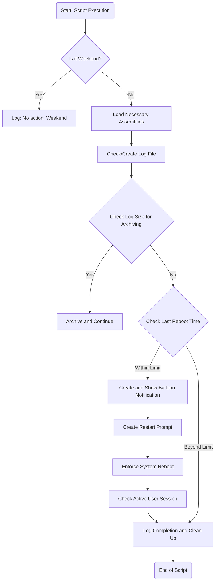

# Reboot Reminder PowerShell Script
## Description
**RebootReminder.ps1** is a PowerShell script designed to encourage regular system reboots to maintain security and performance on Windows-based workstations. It notifies users with balloon notifications to reboot their system if it hasn't been rebooted within a specified threshold and enforces reboots after a defined period. The script is enhanced with functionality to accommodate user work patterns, including the ability to skip reminders on weekends and to only send notifications during work hours.
## Features
- **Weekend Skip**: No reboot reminders are sent on Saturdays and Sundays to avoid disrupting users during off days.
- **Customizable Reminder and Enforcement Schedule**: Administrators can define custom thresholds for sending reminders and enforcing reboots.
- **Enhanced Logging**: All script activities, including any actions skipped due to weekends, are logged for audit and troubleshooting purposes.
- **User Interaction**: Users are prompted with a notification to reboot and have the option to postpone during work hours. Post grace period, a reboot will be enforced to ensure system updates.

The script is intended for daily execution, typically using the Windows Task Scheduler, to monitor system uptime and ensure compliance with organizational reboot policies.
## FlowChart


## Usage
The script accepts various parameters allowing for tailored execution to fit organizational needs.
Here are some examples:

Using default values:

```powershell
./RebootReminder.ps1 -DaysLimit 7
```
This will run the script with the default values for HoursLimit (5 hours), LogPath (C:\temp\RebootLog.log), WorkStart (8 AM), and WorkEnd (5 PM).

### Using custom values:

```powershell
./RebootReminder.ps1 -DaysLimit 7 -HoursLimit 4 -LogPath "C:\logs\RebootLog.log" -WorkStart 9 -WorkEnd 18
```
This will run the script with custom values. The script will enforce a reboot if the computer hasn't been rebooted within 4 hours. It will log the events to C:\logs\RebootLog.log. The script will only send notifications between 9 AM and 6 PM.

## Scheduling the Script with Task Scheduler
You can schedule this script to run automatically using Task Scheduler in PowerShell. Here's an example:

```powershell
$Action = New-ScheduledTaskAction -Execute "powershell.exe" -Argument "-File C:\path\to\your\RebootReminder.ps1 -DaysLimit 7"
$Trigger = New-ScheduledTaskTrigger -Daily -At 9am
$Principal = New-ScheduledTaskPrincipal -UserId "NT AUTHORITY\SYSTEM" -LogonType ServiceAccount -RunLevel Highest
Register-ScheduledTask -Action $Action -Trigger $Trigger -Principal $Principal -TaskName "RebootReminder" -Description "Runs the RebootReminder.ps1 script daily at 9 AM"
```
Replace C:\path\to\your\RebootReminder.ps1 with the actual path to your PowerShell script. The -DaysLimit 7 in the -Argument option is an example of passing parameters to your script. If your script takes additional parameters, add them here.

This will create a new task named RebootReminder that runs the script every day at 9 AM. The task will run with the highest privileges using the SYSTEM account.

Please note, you need to run the PowerShell command prompt as an administrator to register a scheduled task. Also, you may need to adjust the script's execution policy settings or sign the script for it to run correctly as a scheduled task.

## Parameters
- DaysLimit: Mandatory parameter. The number of days to check for the last reboot.
- HoursLimit: Optional parameter. The number of hours before enforcing a reboot. Default is 5 hours.
- LogPath: Optional parameter. The path for the log file. Default is C:\temp\RebootLog.log.
- WorkStart: Optional parameter. The start of the workday in 24-hour format. Default is 8.
- WorkEnd: Optional parameter. The end of the workday in 24-hour format. Default is 17.
## Author
Concept by Cláudio Gonçalves
